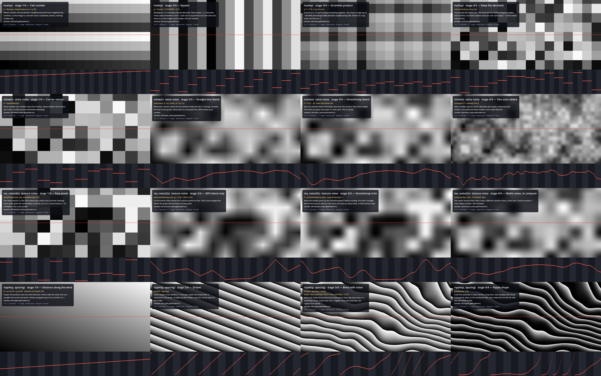

# shader_lib — shared shader functions

Small, documented building blocks used by the water and sand shaders. Each file is a
`.gdshaderinc` you pull in with `#include`. Include guards (`#ifndef`) mean you can include the same
file twice without breaking anything.

```glsl
#include "res://shader_lib/texture_noise.gdshaderinc"   // gives you noise_tex, tex_hash, tex_noise2, tex_noise
```

**See every step:** run the function lab, which draws each function one stage at a time with a
graph underneath:

```
godot --path . res://shader_lib/lab/function_lab.tscn
```

| Key | Action |
|---|---|
| 1–4 or ↑ ↓ | pick the function |
| ← → | previous / next stage |
| wheel, drag | zoom, pan |
| R | reset view |

The top image is the function's output (black = 0, white = 1). The graph plots the values along the
red line. Each light/dark stripe in the graph is one grid unit, so you can see what happens at cell
edges.


Rows: hash, value noise, texture noise, ripple. Columns: stages 1 → 4.
Regenerate it with `godot --path . res://shader_lib/lab/function_lab.tscn -- --capture-lab`.

---

## hash.gdshaderinc — `float hash(vec3 p)`

This gives one random number (0..1) per cell. The same input always returns the same output.

| Stage | Code | What you see |
|---|---|---|
| 1 Cell number | `floor(p)` | An orderly ramp. Neighbouring cells hold neighbouring numbers. |
| 2 Squash | `p = fract(p * 0.3183099 + 0.1)` | Each axis is scaled by 1/π and only the decimals are kept. The image shows stripes, which are still not random. |
| 3 Scramble | `p *= 17.0; x·y·z·(x+y+z)` | A huge product (up to about 250 000) that swings wildly between cells. The lab shows it on a log scale. |
| 4 Keep decimals | `fract(...)` | Looks random: one value per cell. |

Cost: about 10 multiplies.

## value_noise.gdshaderinc — `float noise(vec3 x)`

Smooth random blobs, computed from maths only. Includes `hash`.

| Stage | Code | What you see |
|---|---|---|
| 1 Corners | `hash(floor(p))` | Square blocks. |
| 2 Linear blend | `mix` by `f = fract(p)` | Smooth, but the graph has **kinks** at every grid line, which show up as creases. |
| 3 Smoothstep blend | `f = f·f·(3 − 2f)` first | The kinks are gone, leaving a soft wave. This stage is `noise()`. |
| 4 Two sizes | `noise(p)·0.7 + noise(p·3)·0.3` | Big blobs give the shape and small ones add detail. This is how the sand shader layers noise. |

Cost: 8 hashes, about 80 multiplies, per call.

## texture_noise.gdshaderinc — `tex_hash`, `tex_noise2`, `tex_noise`

The same randomness, precomputed into `textures/noise_128.png`. That file is 128×128 random grey
pixels: **one channel**, 16 KB, imported Lossless with no mipmaps. One channel is enough because
`tex_hash` and `tex_noise2` read the same pixels at unrelated coordinates. `NOISE_LAYER` offsets the
read point to get an independent "layer".

| Stage | Code | What you see |
|---|---|---|
| 1 Raw pixels | `texelFetch(...).r` | Blocks, like `hash()`, from 1 read. This is `tex_hash()`. |
| 2 GPU blend | `textureLod(tex, (p + 0.5) / 128)` | The bilinear filter blends for free. It is still a straight-line blend, so the graph has kinks. |
| 3 Smoothstep trick | read at `floor(p) + smoothstep(fract(p))` | The sample point is moved so the GPU's blend eases. You get the same soft wave in **1 read**. This is `tex_noise2()`. |
| 4 Compare | `noise(vec3(p, 0))` | The maths version: same look, about 80 multiplies. |

`tex_noise(vec3)` blends two layers by `z`, so patterns can change over `TIME`. It costs 2 reads.
The pattern repeats every 128 units.

## ripple.gdshaderinc — `float ripple(vec2 p, float spacing)`

Wind ripples on sand. Returns 0 in the troughs and 1 on the crests. Includes `texture_noise`.

| Stage | Code | What you see |
|---|---|---|
| 1 Distance along wind | `d = p.x·0.35 + p.y·0.94` | A gradient. Points with equal `d` lie on straight lines. |
| 2 Stripes | `fract(d / spacing)` | A sawtooth: parallel stripes `spacing` metres apart. |
| 3 Bend | `fract(d / spacing + warp)` | Noise moves the stripes. ×3 slow noise gives curves and ×0.6 fast noise gives wiggles. |
| 4 Shape | `pow(phase, 3)` | A long gentle slope, then a steep face: the real ripple profile. |

Cost: 2 texture reads. Lighting the ripples (sand step 9) calls it 3× to get a slope.

---

## Where these are used

- `steps/step11_noise_texture.gdshader` and `sand_steps/step11_noise_texture.gdshader` contain inline
  copies, so each tutorial step stays readable on its own. The functions are the same.
- `textures/noise_128.png` comes from `tools/make_noise_texture.py`.
